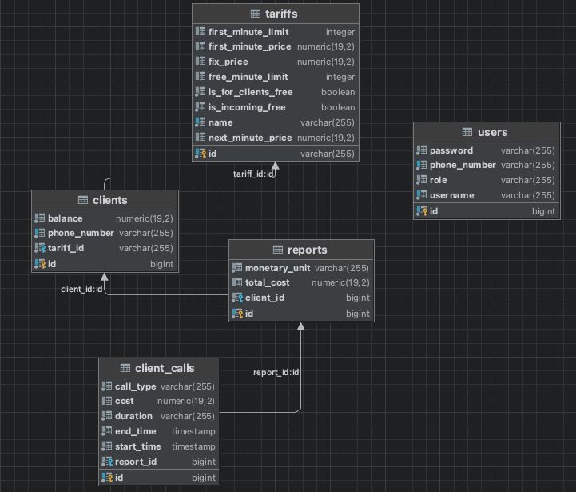

## Common objects & dto

-----

Сервис со всеми обьектами, которые используются в проекте:
- Entity
- Entity dto
- Mapper
- Enums
- Exceptions
- Models dto
- Requests dto
- Responses dto

## Архитектура базы данных:

Таблица с тарифами организована с возможностью добавить новые тарифы, благодаря всем необходимым полям, таким как
- цена за первые и последующие минуты
- фиксированная цена (если имеется)
- минуты входящие в фиксированную стоимость
- бесплатные входящие
- бесплатно для звонков абонентам того же оператора

P.S. неиспользуемые поля просто остаются null.